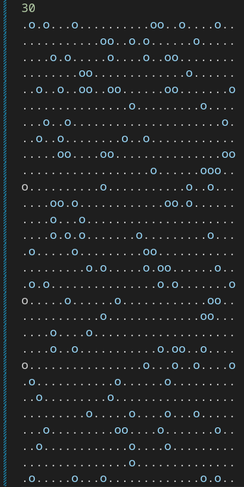
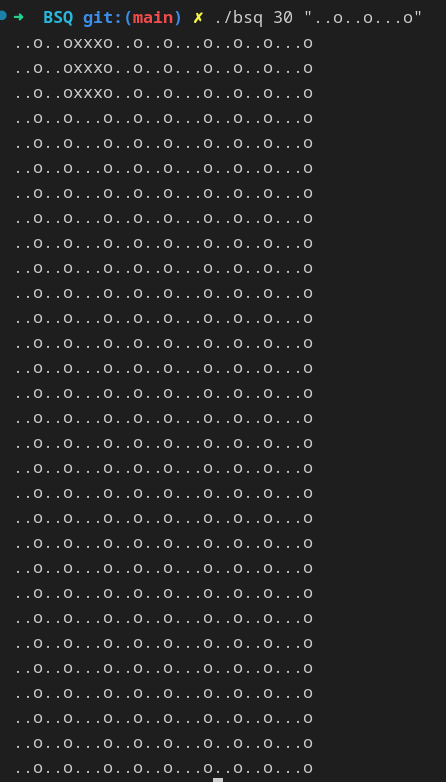

# BSQ

BSQ (Biggest Square) is an algorithmic project realized in C language which aims to solve two distinct problems.

The first one consists in finding the largest possible square at the top left of a map represented as a text file. To be considered valid, the file must respect the following constraints:

- The first line must contain the number of lines in the board (and only that)

- The only characters allowed on the other lines are "." (representing an empty space) and "o" (representing an obstacle)

- All lines must have the same length (except the first one)

- The file must contain at least one line

- Each line must be terminated by "\n".

The second problem consists in generating a map according to the data (the length of the lines and the example of the path that we want for our map) that we specify in parameter during the execution and to find the biggest possible square always on the top left.

And once the square is found, we replace it with "X".

# Here is an exemple of a valid file (30 rows and 30 columns)

## Installation and usage

To use it, follow the instructions below: Clone the repository by entering the following command in your terminal:

    git clone git@github.com:Patricklevyy/BSQ.git

Access the cloned folder and compile the project by entering the command:

    make re

Run the program by entering the command:

To find the largest square in an existing file you can do for example:

    ./bsq maps-intermediate/mouli_maps/intermediate_map_30_30

And the result will be:

To create a new map and find the square inside it you will have to do:

    ./bsq [NUMBER OF ROWS] [PATH]
For example with:

    ./bsq 30 "..o..o...o"

We obtain:

It is quite optimized and can test up to a valid 1000x1000 file in less than 15 seconds.

## Contact

If you have any questions or comments, you can contact us at: gnanmienlie-patrick-levy.n-da@epitech.eu.